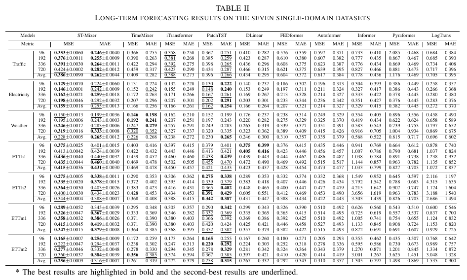
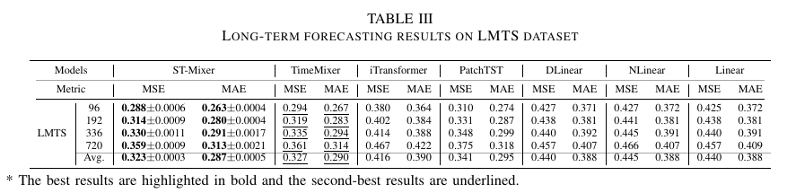

# ST-Mixer
A Seasonality and Trend Mixing Model with Multi-downsampling Fusion Structures for Long-Term Time Series Forecasting

Upload full code as soon as research is accepted

  

#### Performance on Benchmarks   

   

 

  

